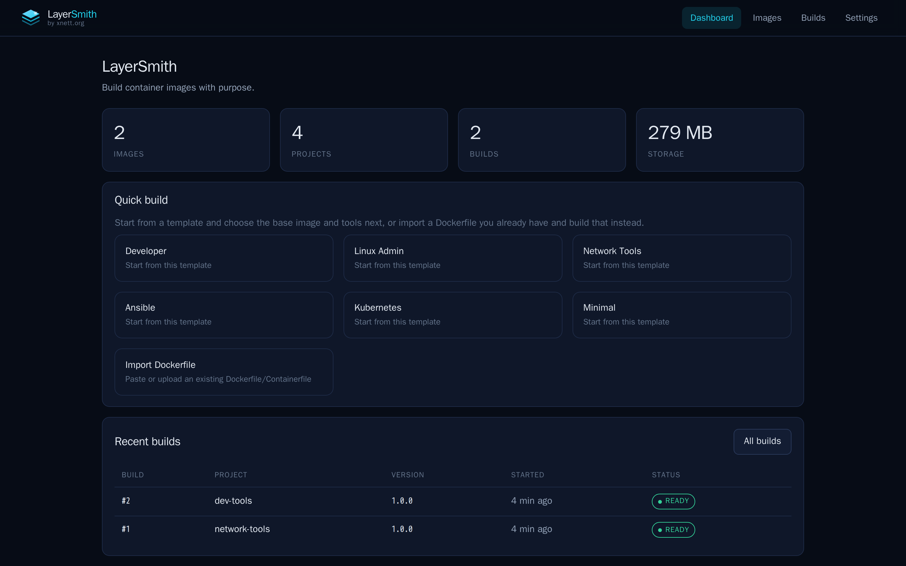
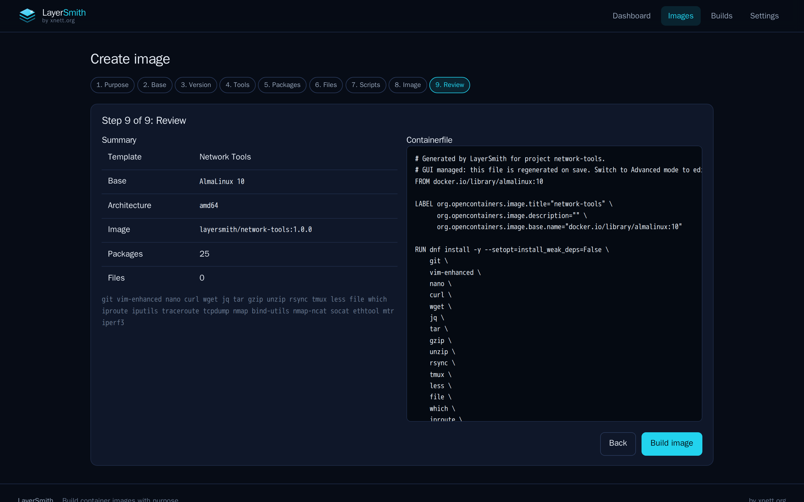
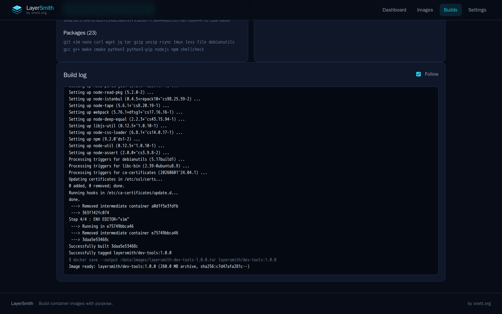
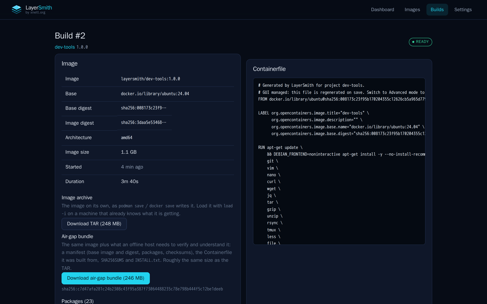
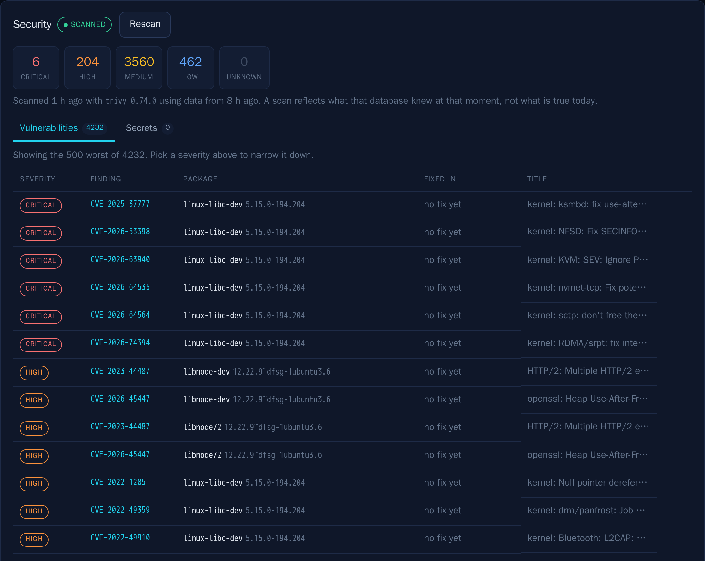
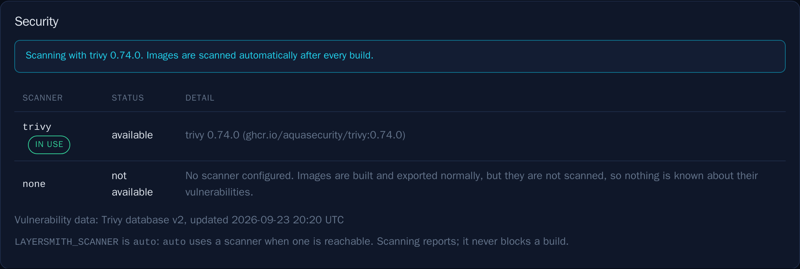

<p align="center">
  
</p>

<h3 align="center">Build container images with purpose.</h3>

<p align="center">
  LayerSmith is a self-hosted web interface for building OCI container images
  without writing Containerfiles by hand. Pick a Linux distribution, say what
  the image is for, choose your tools, build it, and take away an OCI image,
  a TAR archive or an air-gap bundle.
</p>

<p align="center"><sub>by xnett.org</sub></p>

<p align="center">
  
</p>

---

## Quick start

```bash
git clone https://github.com/r0lfi/layersmith.git
cd layersmith
docker compose up -d        # or: podman compose up -d
```

Open <http://localhost:8080>.

With Podman directly, using its rootless socket as the build backend:

```bash
systemctl --user enable --now podman.socket

podman run -d \
  --name layersmith \
  --restart=unless-stopped \
  -p 8080:8080 \
  -v layersmith-data:/data \
  -v $XDG_RUNTIME_DIR/podman/podman.sock:/var/run/docker.sock \
  -e DOCKER_HOST=unix:///var/run/docker.sock \
  ghcr.io/r0lfi/layersmith:latest
```

> **By design, LayerSmith has no login.** It is meant to run on a machine you
> trust — your workstation or a host on your own network — and the mounted
> socket lets it run containers as the socket's owner. If you need
> authentication, put a proxy that provides it in front. See
> [docs/deployment.md](docs/deployment.md) for setups that isolate the builder.

## Why

Writing a good Containerfile by hand means remembering that DNS tools are
`bind-utils` on AlmaLinux, `dnsutils` on Ubuntu and `bind-tools` on Alpine,
that `apt-get` needs `--no-install-recommends` and a cleanup afterwards, and
that a `latest` tag quietly changes under you. LayerSmith knows those things,
and shows you the Containerfile it produced before anything is built.

## Features

- **Purpose-driven templates** — Developer, Linux Admin, Network Tools,
  Ansible, Kubernetes, OpenShift, Minimal, or start from nothing.
- **Distro-aware packages** — templates ask for capabilities, and LayerSmith
  translates them per distribution (`dnf` / `apt` / `apk`).
- **Distributions** — AlmaLinux, Rocky Linux, CentOS Stream, Fedora, Ubuntu,
  Debian, Alpine, or any other OCI base image you name.
- **Generated Containerfile**, shown before you build and editable if you take
  over in Advanced mode.
- **Import** an existing Dockerfile or Containerfile and build that instead.
- **Custom packages, files and scripts** — pre-build, post-install and
  entrypoint hooks.
- **Immutable versioned builds** — a version is built once, never overwritten,
  and each build records its Containerfile, base digest, package list, file
  checksums and log.
- **Digest-pinned bases**, so a rebuild does not silently follow a moved tag.
- **Live build logs**, streamed to the browser.
- **OCI TAR export** with a recorded SHA256.
- **Air-gap bundles** — image, manifest, source Containerfile, `SHA256SUMS`
  and `INSTALL.txt` in one archive that loads with no network access.
- **Optional image scanning** — pluggable, off until you configure a scanner,
  and it reports rather than blocks. See [docs/scanning.md](docs/scanning.md).
- **Podman or Docker** as the build backend.
- **API first** — the web UI uses the same HTTP API you can script against.

## Screenshots

| Dashboard | Create image wizard |
| --- | --- |
|  |  |

| Live build log | Build and image details |
| --- | --- |
|  |  |

Every finished image is scanned, if you configure a scanner. Severity counts
filter the findings; a secret is reported as a rule, a file and a line, never
as the value:





## Two kinds of image

The documentation keeps these apart, and so should you:

| Term | Meaning |
| --- | --- |
| **LayerSmith application image** | `ghcr.io/r0lfi/layersmith` — LayerSmith itself, published by this repository |
| **Built image** | an image a LayerSmith user creates through the web UI |

## Which tag to run

| Tag | Meaning |
| --- | --- |
| `0.2.1` | an exact release — **recommended for production** |
| `0.2`, `0` | newest patch within that minor/major line |
| `latest` | newest stable release |
| `edge` | built from `main` on every merge; development, not stable |

```yaml
services:
  layersmith:
    image: ghcr.io/r0lfi/layersmith:0.2.1
```

Prereleases (`v0.2.0-rc1`) publish only their exact tag; they never move
`latest`.

## Build backends

LayerSmith serves the web application; the actual image building is done by a
container runtime. Supported combinations:

| Running LayerSmith | Build backend | Notes |
| --- | --- | --- |
| Container (Docker) | Docker socket mounted | What `compose.yml` does |
| Container (Podman) | rootless Podman socket mounted | Mount it at `/var/run/docker.sock`; the API is compatible |
| Directly on a host | that host's Podman or Docker | Most isolation, no socket mount |

The application image carries a Docker client only, which also drives a Podman
socket. Running LayerSmith directly on a host uses that host's own client and
can use Podman natively. `LAYERSMITH_BUILD_BACKEND` accepts `auto`, `podman`
or `docker`; the Settings page shows what was detected.

A socket mount is deliberate, not accidental: whoever can reach LayerSmith can
run containers as the socket's owner. `docs/deployment.md` describes the
alternatives.

## Configuration

Everything is optional; see [.env.example](.env.example) for the full list.

| Variable | Default | Purpose |
| --- | --- | --- |
| `LAYERSMITH_DATA_DIR` | `/data` | Everything LayerSmith keeps, including the database |
| `LAYERSMITH_IMAGE_DIR` | `$DATA/images` | Exported archives and air-gap bundles |
| `LAYERSMITH_BUILD_DIR` | `$DATA/builds` | Build contexts |
| `LAYERSMITH_UPLOAD_DIR` | `$DATA/uploads` | Uploaded files |
| `LAYERSMITH_LOG_DIR` | `$DATA/logs` | Build logs |
| `LAYERSMITH_TMP_DIR` | `$DATA/tmp` | Scratch space |
| `LAYERSMITH_SCAN_DIR` | `$DATA/scans` | Scan reports and SBOMs |
| `LAYERSMITH_DATABASE_URL` | `sqlite:///$DATA/layersmith.db` | Any SQLAlchemy URL |
| `LAYERSMITH_BUILD_BACKEND` | `auto` | `auto`, `podman` or `docker` |
| `LAYERSMITH_DEFAULT_ARCH` | `amd64` | Architecture offered first |
| `LAYERSMITH_DEFAULT_NAMESPACE` | `layersmith` | Namespace for new image names |
| `LAYERSMITH_MAX_UPLOAD_BYTES` | 512 MiB | Largest accepted upload |
| `LAYERSMITH_MAX_FILES_PER_IMAGE` | `100` | Files and tools one image may reference |
| `LAYERSMITH_MAX_CONTEXT_BYTES` | 2 GiB | Largest build context |
| `LAYERSMITH_SCANNER` | `auto` | Image scanner: `auto`, `none`, or a scanner name |
| `LAYERSMITH_SCAN_AFTER_BUILD` | `1` | Scan each image once it is built |
| `LAYERSMITH_SCAN_KINDS` | `vulnerability,secret` | What a scan looks for |
| `LAYERSMITH_GENERATE_SBOM` | `1` | Produce a CycloneDX SBOM with a scan |

The six paths under the data directory are also editable at runtime in
**Settings → Storage**. A value set in the environment wins and is shown
read-only there. Changing a path never moves existing files, and archives
written earlier stay downloadable.

## Data and upgrades

All state lives under `/data`: the database, exported images, build contexts,
uploads and logs. Keep that volume and an upgrade keeps your projects, build
history and archives.

```bash
docker compose pull && docker compose up -d
```

```bash
podman pull ghcr.io/r0lfi/layersmith:latest
podman rm -f layersmith
# then re-run your original podman run command
```

Back up the volume the ordinary way; `/data` is all there is.

## Architecture

- **Backend** — FastAPI, SQLite by default, one build worker thread.
- **Frontend** — React and Vite, served by the backend on the same port.
- **Build backends** — a small interface (`available`, `resolve_base`,
  `build`, `inspect`, `export`, `remove`) with Podman and Docker
  implementations, so a remote build agent can be added without touching the
  rest.
- **Scanners** — the same arrangement for image scanning (`available`,
  `health`, `version`, `database_info`, `scan_image`, `generate_sbom`), with
  no scanner configured by default.

## Security

LayerSmith runs build jobs, so it is treated as security-sensitive:

- Commands are built as argv lists; no user value is interpreted by a shell.
- Image references, package names, paths, versions and environment variable
  names are matched against explicit patterns before use.
- Uploaded files are content-addressed and re-verified by checksum before
  entering a build context.
- Environment variables that look like credentials are refused: secrets must
  not be baked into an image.
- Downloads are limited to directories LayerSmith itself writes to.
- Uploaded files are refused if they are links, and a build context is
  bounded in file count and total size.
- An unknown `/api/` path answers as the API, so a mistyped endpoint cannot
  be mistaken for a working one.
- Image scanning, when configured, is handed an exported archive rather than
  the container runtime's socket, in a container with every capability
  dropped and one read-only mount.
- Secret findings record a rule, a file and a line - never the value - and
  the image's build history is stripped from a stored scan report.

An image LayerSmith has not scanned is reported as unknown, never as clean;
see [docs/scanning.md](docs/scanning.md).

**Deliberate boundaries**, in full in
[docs/deployment.md](docs/deployment.md): no built-in authentication (run it
somewhere you trust, or front it with a proxy); a build runs code you supply;
nothing is garbage collected; no quotas; one build at a time.

LayerSmith is scanned by its own CI on every push and weekly: dependencies,
the repository's whole history for secrets, and the published application
image. See [SECURITY.md](SECURITY.md), and report vulnerabilities privately.

## Development

```bash
cd backend
python3 -m venv .venv && .venv/bin/pip install -e '.[dev]'
.venv/bin/pytest                 # no container runtime needed
.venv/bin/uvicorn layersmith.api:create_app --factory --reload --port 8080

cd ../frontend
npm install && npm run dev       # proxies /api to port 8080
```

See [CONTRIBUTING.md](CONTRIBUTING.md) for the longer version, and
[docs/RELEASING.md](docs/RELEASING.md) for how releases are cut.

## License

MIT — see [LICENSE](LICENSE).
